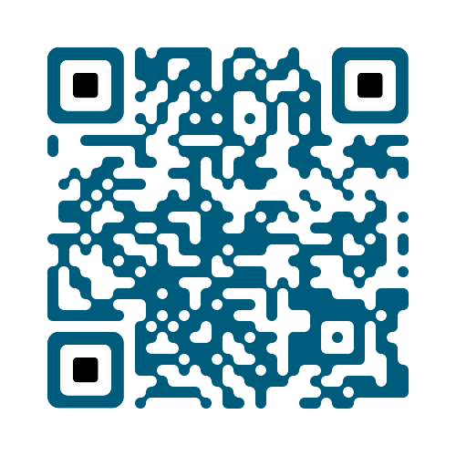

Word List 1
============

	

## emperor
> [ˈempərə(r)]  _n._ 皇帝
> 
> __例句__
> > The executive of a republic can not do what a king or **emperor** does.  
> > 共和国的领导人不能像国王或君主那样行事。

## exact \*
> [ɪgˈzækt]  _a._ 精确的；准确的
> 
> __例句__
> > What is the **exact** amount left in your savings account?  
> > 你的储蓄账户里到底还有多少余额？
> 
> __派生词__
> > exactly /ɪgˈzæktli/ _ad._ 正确的；完全的
> > 

## traditional \*
> [trəˈdɪʃənl]  _a._ 传统的，惯例的；口传的，传说的
> 
> __搭配用法__
> 
> | 短语 |  意思 |  
> | --- | ----- | 
> | traditional view | 传统观点 |
> | traditional belief | 传统信条 |
> | traditional industry | 传统工业 | 
> | traditional methods | 传统方法 |
> | traditional culture | 传统文化 |
> | traditional Chinese medicine | 中药 |
>
> __例句__
> > Rosewood is a pure example of a **traditional** country house of this part of England.
> > 红木建筑是英格兰这个地区传统乡间住宅的典型代表。

## lack \*
> [læk]  _n./vt._ 缺乏，不足，没有
> 
> __搭配用法__
> 
> | 短语 |  意思 |  
> | --- | ----- | 
> | lack of | 缺乏，没有 |
> | lack (for) nothing | 啥都不缺 |
>
> __例句__
> > Martin can not afford the book due to **lack** of money. 
> > 马丁应为缺钱而买不起这本书。

## pardon \*
> [ˈpɑːdn] _excl._ (用于请求某人重复做某事)什么，请再说一遍 _n./vt._ 原谅，宽恕；赦免
> 
> __例句__
> > A. Hurry up! Lucy.
> > B. Pardon?
> > A. I said hurry up.

## regent
> [ˈriːdʒənt] _n._ 摄政者
> 
> __例句__
> 
> > George acted as a **regent** when the present king was a child.
> > 当现任国王还是孩子的时候，乔治是摄政王。

## burgeon \*
> [ˈbɜːdʒən] _vi._ 迅速成长；发展
> 
> __例句__
> 
> > To serve the **burgeoning** tourist industry, an array of professionals has emerged.
> > 为了满足日益繁荣的旅游业的发展需求，已经出现了一大批专业人员。

## argue \*
> [ˈɑːgjuː] _v._ 争论；说服
> 
> __搭配用法__
> 
> | 短语 |  意思 |  
> | --- | ----- |  
> | argue sb. into doing sth.  | 说服某人做某事 |
> | argue db. out of doing sth. |  说服某人不要做某事 |
> | argue for | 赞成；要求  |
> | argue about | 议论…… |
> | argue over | 辩论／争论…… |
> 
> __例句__
> 
> > The study argues that the type of action needed against passive smoking should be similar to that being taken against AIDS.
> > 该研究认为人们需要采取类似防范艾滋病的方法来防范被动吸烟。  
> 
> __派生词__
> 
> > arguably _ad._ 可论证的；可辩解的

## barely \*
> [ˈbeəli] _ad._ 仅仅，几乎不；赤裸裸地，无遮蔽地
> 
> __例句__
> 
> > Rainfall barely penetrates the soil in this area.
> > 在该地区降水很少渗入土壤。

## methane \*
> [ˈmiːθeɪn] _n._ 甲烷 [不可数名词]
> 
> __例句__
> 
> > We use methane as fule.
> > 我们用甲烷当作燃料。

## hierarchy
> [ˈhaɪərɑːki] _n._ 领导层；层次，等级
> 

## guidance
> [ˈgaɪdns] _n._ 引导，指导
> 

## easy-going
> [ˈiːzi gəʊing] _n._ 脾气随和的，心平气和的；随便的
> 

## electrical
> [ɪˈlektrɪkl] _n._ 电的，电学的，有关电的
> 

## electronic
> [ˌɪlekˈtrɒnɪk] _n._ 电子的
> 

## roll film
>  _n._ 胶卷
> 

## philosophy
> [fɪˈlɒsəfi] _n._ 哲学；哲理
> 

## chronic
> [ˈkrɒnɪk] _a._ （疾病）慢性的；积习难改的
> 

## desirable
> [dɪˈzaɪərəbl] _a._ 值得拥有的；合意的；可取的，有利的
> 

## consortium
> [kənˈsɔːtɪəm] _n._ 集团；财团；社团，协会
> 

## buckle
> [ˈbʌkl] _n._ 皮带扣环 _vt._ 扣紧；（使）变形；弯曲
> 

## curry
> [ˈkʌri] _n._ 咖喱 _vt._ 把（肉、蔬菜等）做成咖喱食品；梳刷（马毛等）
> 

## subliminal
> [səbˈlɪmɪnl] _a._ 下意识的，潜意识的
> 
> subliminal advertising 隐性广告

## chamber \*
> [ˈtʃeɪmbə] _n._ 室；洞穴；（枪）膛
> 

## frequent \*
> [ˈfriːkwənt] _a._ 频繁的，常见的，常用的
> 

## presperous \*
> [ˈprɒspərəs] _a._ 繁荣的，兴旺的；成功的
> 

## purpose \*
> [ˈpɜːpəs] _n._ 目的，意图；用途，效果； _v._ 打算，企图，决心
> 

## variety
> [vəˈraɪəti] _n._ 品种，种类；变化，多样化
> 

## immigration
> [ɪmɪˈɡreɪʃn] _n._ 外来的移民；移居
> 

## natural
> [ˈnatʃ(ə)r(ə)l] _n._ 正常的，普通的，自然的；自然界的，天然的；天赋的，固有的
> 

## bet
> [bɛt] _n._ 赌，打赌；  打赌，赌注
> 

## consumer
> [kənˈsjuːmə] _n._ 消费者；用户
> 

## physician
> [fɪˈzɪʃ(ə)n] _n._ 内科医生，医师
> 

## equal
> [ˈiːkw(ə)l] _a._ 相等的 _vt._ 比得上
> 

## resort
> [rɪˈzɔːt] _n._ 求助；诉诸；胜地 _vi._ 求助；诉诸
> 

## leadership
> [ˈliːdəʃɪp] _n._ 领导，领导层；领导能力
> 

## equity
> [ˈɛkwɪti] _n._ 公平，公正
> 

## excavate
> [ˈɛkskəveɪt] _vt._ 挖掘，开凿
> 

## nuclear
> [ˈnjuːklɪə] _a._ 核能的，原子能的
> 

## mutual
> [ˈmjuːtʃʊəl, ˈmjuːtʃ(ə)l] _n._ 相互的，共同的
> 

## hectare
> [ˈhɛktɛː, ˈhɛktɑː] _n._ 公顷
> 

## density
> [ˈdɛnsɪti] _n._ 密集；浓度，密度
> 

## massive
> [ˈmasɪv] _n._ 大而重的，厚实的，粗大的；大量的，大规模的
> 

## congratulate
> [kənˈɡratjʊleɪt] _n._ 祝贺
> 

## companion
> [kəmˈpanjən] _n._ 共事者；同伴
> 

## rig
> [rɪɡ] _n._ 操纵，垄断；船桅的装置；成套机械
> 

## input
> [ˈɪnpʊt] _n._ 投入，输入；输入的数据   把……输入计算机
> 

## merely
> [ˈmɪəli] _n._ 仅仅，只不过
> 

## impart
> [ɪmˈpɑːt] _n._ 给予，赋予；传授；告知，透露
> 

## forfeit
> [ˈfɔːfɪt] _v._ （因犯规而）丧失，失去 _n._ 罚款，代价
> 

## calorie
> [ˈkaləri] _n._ 卡路里，大卡（食物的热量）
> 

## van
> [van] _n._ 货车
> 

## ventilation
> [ˌvɛntɪˈleɪʃ(ə)n] _n._ 空气流通；通风设备，通风方法
> 

## intermediate
> [ˌɪntəˈmiːdɪət] _a._ 中间的，中级的
> 

## eternal
> [ɪˈtəːn(ə)l, iːˈtəːn(ə)l] _n._ 永恒的
> 

## invasion
> [ɪnˈveɪʒ(ə)n] _n._ 入侵，侵略
> 

## nevertheless
> [nɛvəðəˈlɛs] _n._ 仍然，然而  然而，不过
> 

## celebrate
> [ˈsɛlɪbreɪt] _v._ 赞扬，歌颂；庆祝
> 

## inspiring
> [ɪnˈspʌɪərɪŋ] _n._ 鼓舞人心的；启发灵感的
> 

## attendance
> [əˈtɛnd(ə)ns] _n._ 到场，出席；出勤；伺候，照料
> 

## optional
> [ˈɒpʃ(ə)n(ə)l] _a._ 可选择的，非强制的，随意的
> 

## enable
> [ɪˈneɪb(ə)l, ɛˈneɪb(ə)l] _v._ 是能够，使成为可能
> 

## departmental
> [diːpɑːtˈmɛnt(ə)l] _a._ 部门的
> 

## heal
> [hiːl] _v._ 治愈，康复；调停
> 

## dismantle
> [dɪsˈmant(ə)l] _v._ 拆除；废除，取消
> 

## wage
> [weɪdʒ] _n._ 工资；[ 常 _pl._] 报酬
> 

## landscape
> [ˈlan(d)skeɪp] _n._ 风景 _vt._ 对……做景观美化，美化（自然环境等）
> 

## emotion
> [ɪˈməʊʃ(ə)n] _n._ 感情，情绪
> 

## commonwealth
> [ˈkɒmənwɛlθ] _n._ 英联邦，联合体
> 

## newsletter
> [ˈnjuːzlɛtə] _n._ 时事通讯，业务通讯
> 

## periodical
> [pɪərɪˈɒdɪk(ə)l] _n._ 期刊，杂志； _a._ 周期的，定期的
> 

## receptionist
> [rɪˈsɛpʃ(ə)nɪst] _n._ 接待员
> 

## security
> [sɪˈkjʊərɪti, sɪˈkjɔːrɪti] _n._ 安全，保障；抵押品；[_pl._]证券
> 

## clip
> [klɪp] _n._ （弹簧）夹子，回形针，别针；弹夹；修剪；简报，电影（或电视）片段 _v._ （用夹子、回形针等）夹住，扣住；剪，修剪
> 

## apace
> [əˈpeɪs] _a._ 快速的，极速的
> 

## yield
> [jiːld] _n._ 产量 _v._ 出产；放弃
> 

## fair
> [fɛː] _a/ad._ 公平的／地
> 

[online_mp3]: http://download.dogwood.com.cn/online/yschlx/WordList01.mp3